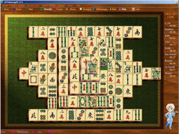



## VBMahjongg Beta8 \[Tiny version for Fixed Download\]

### Description

VBMahjongg 2.1 its a fully game write completly in visual basic with out any external DLL, Ocx or

libs. *See* the animated screen shot to believe it. This classical Chinese Game contais more than 100 varaitions of

original game, and give you the oportunity to make new ones with the level editor. New improved

routine than makes all the puzzles have solution (i've seen some COMERCIAL Mahjongg puzzles that

generates un-solvables puzzles!). More than 30 Tilesets, Backgrounds, Midi Music and sound effects,

HallFame board, etc. The game supports several Languages. Only make the apropiate translation

file and put it on language folder and voilá...a new language its available. No re-code nothing.

The same occurs with TileSets, Musics and Backgrounds. This is not "easy" code. More than 14 Modules

and 10 Forms (yes, a optimization is needed, i know this xDD). See Readme.txt for *importat* notes.

Compile the code and run the executable for correct Menu Subclassing.

Especial Thanks goes to: René-Gilles Deberdt (the original author of Kyodai Game), G. D. Sever (Menu

Sublassing routines), Kailash Nadh (for his Unveliable Screen Effects) and all the betatesters that

improve testing for this game around several weeks.

If you like this game, well...a vote will be apreciated..xDDD, and of course, any report (good or bad) will be

studied for future revisions.

PSC don't le me upload large files.

For this reason this version not has all the graphics

See you.
 
### More Info
 

             |
---                |---
**Submitted On**   |2003-08-20 19:04:56
**By**             |[John Ripper](https://github.com/Planet-Source-Code/PSCIndex/blob/master/ByAuthor/john-ripper.md)
**Level**          |Advanced
**User Rating**    |4.8 (119 globes from 25 users)
**Compatibility**  |VB 4\.0 \(32\-bit\), VB 5\.0, VB 6\.0
**Category**       |[Games](https://github.com/Planet-Source-Code/PSCIndex/blob/master/ByCategory/games__1-38.md)
**World**          |[Visual Basic](https://github.com/Planet-Source-Code/PSCIndex/blob/master/ByWorld/visual-basic.md)
**Archive File**   |[VBMahjongg1633048202003\.zip](https://github.com/Planet-Source-Code/john-ripper-vbmahjongg-beta8-tiny-version-for-fixed-download__1-47871/archive/master.zip)

